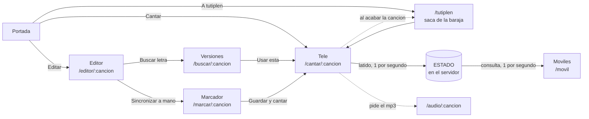

# 🎤 Karaoke Aramar

Karaoke casero en red local: la letra se ilumina al ritmo de la canción en la tele, y todos los móviles de la casa siguen la misma letra sincronizada desde el navegador. Nadie instala nada, y una vez arrancado no hace falta internet para cantar.

Hecho con **Flask** y JavaScript sin librerías.

---

## Qué hace

- **Lee la carpeta de canciones** y monta el catálogo solo: cada canción son dos ficheros hermanos, el `.mp3` y su letra `.lrc`.
- **Resalta la línea que toca cantar** sobre un escenario en 3D, con scroll automático y **cuenta atrás** en los huecos, para saber cuándo entrar.
- **Dos modos de juego**: elegir canción a mano, o **karaoke a tutiplén** — arranca y va encadenando canciones al azar, sin repetir ninguna hasta que hayan sonado todas.
- **Código QR en la portada** para que los móviles se enganchen sin dictar direcciones IP.
- **Tres formas de conseguir la letra sincronizada**: descargarla de [LRCLIB](https://lrclib.net), re-cronometrarla automáticamente escuchando la canción, o marcarla a mano con el teclado.

## Cómo está montado



### Las decisiones que explican el diseño

**El audio suena en un solo sitio.** Si cada móvil reprodujera su copia del MP3, se desincronizarían por el buffering y la latencia del altavoz, y el oído detecta desfases de 30 ms como eco. Los móviles solo pintan letra: **la letra perdona décimas, el audio no.**

**El móvil lleva su propio reloj.** Pregunta al servidor una vez por segundo, pero repinta diez veces por segundo estimando cuánto ha pasado desde la última respuesta. Sin eso, la letra avanzaría a saltos de un segundo. Es lo mismo que hace un GPS entre señal y señal.

**Baraja, no dado.** El modo aleatorio no tira un dado en cada canción: baraja la lista entera y la recorre, y solo al agotarla vuelve a barajar. Con azar puro saldría dos veces la misma antes de que sonaran otras muchas.

**El QR se calcula en cada visita, no al arrancar.** La IP que imprime Flask en la terminal se escribe una sola vez y se queda obsoleta en cuanto cambias de red, suspendes el portátil o el router renueva la dirección. El QR pregunta al sistema por la IP en el momento de servir la página.

**Sin base de datos.** La carpeta `canciones/` es la fuente de la verdad: si borras un MP3, la canción desaparece de la app. No hay dos sitios que puedan desincronizarse.

## Puesta en marcha

```bash
python -m venv .venv
.venv\Scripts\activate
python -m pip install flask requests mutagen qrcode
python app.py
```

En `http://localhost:5055`. Ya arranca con `host="0.0.0.0"`, así que la tele y los móviles de la casa entran con la IP del ordenador — **o escaneando el QR de la portada**, que es para lo que está.

> Si `pip` te lo bloquea una política del sistema, usa `python -m pip` en lugar de `pip` a secas: así se ejecuta el intérprete (firmado) en vez de `pip.exe`.

Para el re-cronometrado automático hace falta además `faster-whisper`. Es opcional: la app funciona sin él.

## Añadir canciones

1. Copia el `.mp3` a `canciones/` con el nombre en minúsculas y separado por guiones: `artista-titulo.mp3`. Ese nombre es a la vez el identificador de la URL y la consulta que se manda a LRCLIB, así que conviene que esté limpio.
2. Baja las letras que falten:

```bash
python bajar_letras.py
```

Salta las que ya tengan `.lrc`, así que puedes repetirlo sin miedo.

> Las descargas de vídeo suelen ser **MP4 con la extensión cambiada a `.mp3`**. `python convertir_a_mp3.py` los detecta por los primeros bytes del fichero y los convierte de verdad.

## Sincronizar la letra

Tres vías, de menos a más trabajo:

**1. Descargarla ya sincronizada** — `bajar_letras.py`, o *Editor → Buscar en internet*.
Elegir la versión **por duración** es crítico: una misma canción tiene versiones que van de 185 a 237 segundos, y equivocarse desfasa la letra entera.

**2. Re-cronometrarla automáticamente**

```bash
python sincronizar.py --todas
```

Whisper escucha la canción y devuelve cada palabra con su instante. Se emparejan esas palabras con las del `.lrc`, y donde coinciden queda un **ancla**; el resto se interpola. **El texto sale del `.lrc` y los tiempos de la canción.**

No pisa nada: escribe un `.lrc.nuevo` al lado y deja un informe con las canciones ordenadas **de más a menos sospechosa**, para revisar solo las de arriba.

**3. Marcarla a mano** — *Editor → Sincronizar a mano*.
Le das al play y pulsas **ESPACIO** cuando entra cada frase. El texto es editable y se pueden insertar líneas que la letra descargada se dejó. Es la salida para lo que la máquina no puede: **euskera**, y las canciones donde el alineador se pierde.

### Lo que se midió

| Prueba | Resultado |
|---|---|
| Reconocimiento sobre la mezcla (`medium`) | **46%** de las palabras |
| Aislando la voz antes con Demucs | **38%** — *empeora*, y tarda el doble |
| Modelo `large-v3` | 48% — dos puntos por el doble de tiempo |
| Forzando el idioma correcto | **6% → 77%** en un caso |

De ahí salen las dos conclusiones del diseño: **sacar la letra del audio no sirve** (con menos de la mitad de las palabras habría que reescribirla entera), y **el idioma mal detectado es el fallo que más daño hace** — Whisper llegó a detectar ruso en tres canciones inglesas.

## Ficheros

| | |
|---|---|
| `app.py` | El servidor: todas las rutas y el estado compartido |
| `lrclib.py` | Cliente de la API de LRCLIB |
| `bajar_letras.py` | Descarga de letras en lote |
| `sincronizar.py` | Re-cronometrado automático con Whisper |
| `convertir_a_mp3.py` | Arregla descargas que son MP4 disfrazado |
| `static/karaoke.js` | El motor del karaoke, compartido por tele y móvil |
| `static/marcar.js` | El sincronizador a mano |
| `static/style.css` | Una sola hoja, el modo lo decide la clase del `<body>` |
| `templates/` | Las seis páginas |
| `canciones/` | Los datos: `.mp3` (fuera del repo) y `.lrc` |
| `MAPA.md` | Mapa del proyecto: qué hay hecho, qué falta y por qué está cada decisión |

## El formato LRC

El estándar de los karaokes desde los 90, y por eso las letras son portables a otros reproductores:

```
[00:13.76]primera frase de la cancion
[00:20.12]segunda frase
[00:28.10]
```

`[minutos:segundos.centésimas]` y detrás el texto. Una línea con sello y **sin texto** marca un silencio: es lo que hace que la última frase desaparezca de la pantalla en vez de quedarse congelada hasta el final del MP3.

## Nota

Los MP3 no se versionan (`.gitignore`): pesan y no son míos. Los `.lrc` sí, porque ocupan nada y llevan trabajo detrás.

Proyecto de aprendizaje: Python, Flask, Jinja, JavaScript y algo de CSS.
