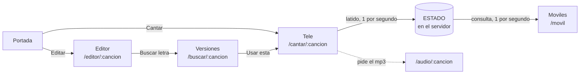

# 🎤 Karaoke Aramar

Karaoke casero en red local: la letra se ilumina al ritmo de la canción en la tele, y todos los móviles de la casa siguen la misma letra sincronizada desde el navegador. Sin instalar nada en los móviles, sin internet mientras se canta.

Hecho con **Flask** y JavaScript sin librerías.

---

## Qué hace

- **Lee la carpeta de canciones** y monta el catálogo solo: cada canción son dos ficheros hermanos, el `.mp3` y su letra `.lrc`.
- **Resalta la línea que toca cantar** sobre un escenario en 3D, con scroll automático y cuenta atrás antes de cada entrada.
- **Descarga las letras sincronizadas** de [LRCLIB](https://lrclib.net) eligiendo la versión cuya duración coincide con tu MP3 — si te equivocas de versión, la letra va desfasada toda la canción.
- **Editor de letras** para corregir tiempos a mano, con un sello `[mm:ss.cc]` en vivo listo para copiar.
- **Pantalla y mandos**: la tele reproduce y manda; los móviles muestran la misma letra, sincronizada, y se enganchan aunque llegues a mitad de canción.

## Cómo está montado



**El audio suena en un solo sitio.** Si cada móvil reprodujera su copia del MP3, se desincronizarían por el buffering y la latencia del altavoz, y el oído detecta desfases de 30 ms como eco. Los móviles solo pintan letra: **la letra perdona décimas, el audio no.**

**El móvil lleva su propio reloj.** Pregunta al servidor una vez por segundo, pero repinta diez veces por segundo estimando cuánto ha pasado desde la última respuesta. Sin eso, la letra avanzaría a saltos de un segundo. Es la misma idea que usa un GPS entre señal y señal.

**Sin base de datos.** La carpeta `canciones/` es la fuente de la verdad: si borras un MP3, la canción desaparece de la app. No hay dos sitios que puedan desincronizarse.

## Puesta en marcha

```bash
python -m venv .venv
.venv\Scripts\activate
pip install flask requests mutagen
python app.py
```

En `http://localhost:5055`. Para que lo vean la tele y los móviles de casa, ya arranca con `host="0.0.0.0"`: entra desde los demás aparatos con la IP del ordenador, `http://192.168.1.X:5055`.

## Añadir canciones

1. Copia el `.mp3` a `canciones/`, con el nombre en minúsculas y separado por guiones: `artista-titulo.mp3`. Ese nombre es el identificador y también la consulta que se manda a LRCLIB.
2. Baja las letras que falten:

```bash
python bajar_letras.py
```

Salta las que ya tengan `.lrc`, así que puedes repetirlo sin miedo. Las que no encuentre —o que solo existan en otra duración— se resuelven desde *Editar → Buscar en internet*, eligiendo la versión a mano.

## Ficheros

| | |
|---|---|
| `app.py` | El servidor: todas las rutas |
| `lrclib.py` | Cliente de la API de LRCLIB |
| `bajar_letras.py` | Script de consola: descarga en lote |
| `static/karaoke.js` | Todo el motor del karaoke, compartido por tele y móvil |
| `templates/` | Las cinco páginas |
| `canciones/` | Los datos: `.mp3` (fuera del repo) y `.lrc` |
| `MAPA.md` | Mapa del proyecto: qué hay hecho, qué falta y por qué está cada decisión |

## El formato LRC

El estándar de los karaokes desde los 90, y por eso las letras son portables a otros reproductores:

```
[00:13.76]Esaiozu euriari berriz, ez jauzteko
[00:20.12]esan bakardadeari gaur ez etortzeko
[00:28.10]
```

`[minutos:segundos.centésimas]` y detrás el texto. Una línea con sello y sin texto marca un silencio — es lo que hace que la última frase desaparezca en vez de quedarse congelada hasta el final.

## Nota

Los MP3 no se versionan (`.gitignore`): pesan y no son míos. Los `.lrc` sí, porque ocupan nada y varios están corregidos a mano.

Proyecto de aprendizaje: Python, Flask, Jinja, JavaScript y algo de CSS.
